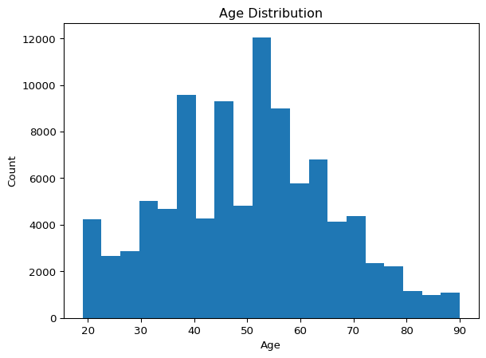
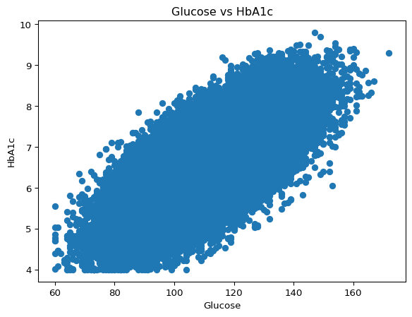
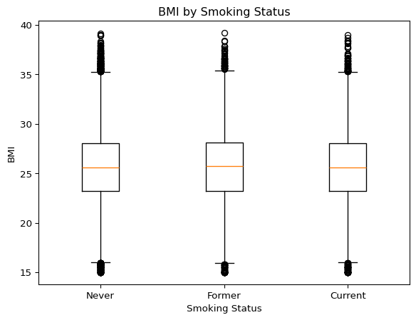
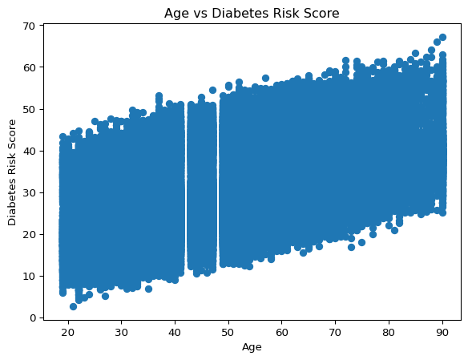
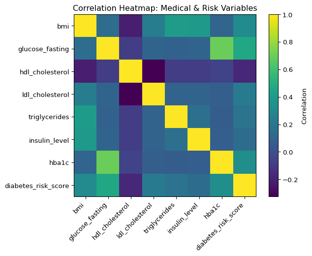
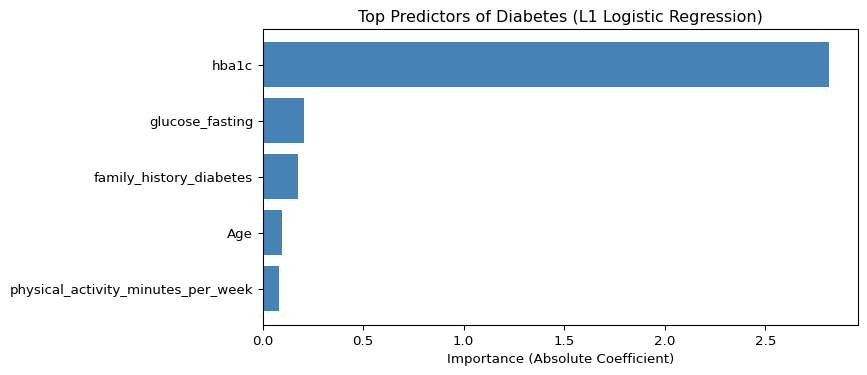

# Final Project
Josh Yago

Introduction

I chose the diabetes dataset for a personal reason. One of my closest
friends has lived with Type 1 diabetes for as long as I have known him.
Even though this dataset focuses on diagnosed diabetes more broadly,
many of the same biomarkers and risk factors appear in both conditions.
This project was an opportunity for me to better understand the
terminology, the predictors, and the lifestyle factors that affect
diabetes risk.

My goal was not just to run models, but to tell a meaningful story about
what influences diabetes and how data can help us understand a condition
that affects millions of people.

Understanding the Dataset

``` python
import pandas as pd

diabetes = pd.read_csv("/Users/joshyago/Downloads/Diabetes_and_LifeStyle_Dataset .csv")

diabetes
```

<div>


|  | Age | gender | ethnicity | education_level | income_level | employment_status | smoking_status | alcohol_consumption_per_week | physical_activity_minutes_per_week | diet_score | ... | hdl_cholesterol | ldl_cholesterol | triglycerides | glucose_fasting | glucose_postprandial | insulin_level | hba1c | diabetes_risk_score | diabetes_stage | diagnosed_diabetes |
|----|----|----|----|----|----|----|----|----|----|----|----|----|----|----|----|----|----|----|----|----|----|
| 0 | 58 | Male | Asian | Highschool | Lower-Middle | Employed | Never | 0 | 215 | 5.7 | ... | 41 | 160 | 145 | 136 | 236 | 6.36 | 8.18 | 29.6 | Type 2 | 1 |
| 1 | 52 | Female | White | Highschool | Middle | Employed | Former | 1 | 143 | 6.7 | ... | 55 | 50 | 30 | 93 | 150 | 2.00 | 5.63 | 23.0 | No Diabetes | 0 |
| 2 | 60 | Male | Hispanic | Highschool | Middle | Unemployed | Never | 1 | 57 | 6.4 | ... | 66 | 99 | 36 | 118 | 195 | 5.07 | 7.51 | 44.7 | Type 2 | 1 |
| 3 | 74 | Female | Black | Highschool | Low | Retired | Never | 0 | 49 | 3.4 | ... | 50 | 79 | 140 | 139 | 253 | 5.28 | 9.03 | 38.2 | Type 2 | 1 |
| 4 | 46 | Male | White | Graduate | Middle | Retired | Never | 1 | 109 | 7.2 | ... | 52 | 125 | 160 | 137 | 184 | 12.74 | 7.20 | 23.5 | Type 2 | 1 |
| ... | ... | ... | ... | ... | ... | ... | ... | ... | ... | ... | ... | ... | ... | ... | ... | ... | ... | ... | ... | ... | ... |
| 97292 | 46 | Male | Other | Graduate | Upper-Middle | Unemployed | Former | 1 | 136 | 8.3 | ... | 45 | 150 | 116 | 113 | 109 | 14.58 | 5.55 | 26.0 | Pre-Diabetes | 0 |
| 97293 | 41 | Female | White | Graduate | Middle | Employed | Never | 3 | 76 | 8.8 | ... | 55 | 123 | 146 | 96 | 146 | 9.02 | 5.97 | 24.4 | Pre-Diabetes | 0 |
| 97294 | 57 | Female | Black | No formal | Upper-Middle | Employed | Former | 4 | 121 | 9.9 | ... | 50 | 111 | 184 | 93 | 132 | 2.57 | 5.21 | 27.6 | No Diabetes | 0 |
| 97295 | 47 | Female | Black | Highschool | Lower-Middle | Retired | Never | 3 | 52 | 5.9 | ... | 68 | 91 | 116 | 106 | 117 | 9.81 | 5.53 | 26.4 | Pre-Diabetes | 0 |
| 97296 | 52 | Female | White | Postgraduate | Middle | Employed | Never | 1 | 248 | 2.7 | ... | 31 | 183 | 87 | 91 | 142 | 15.93 | 5.73 | 27.9 | Pre-Diabetes | 0 |

<p>97297 rows × 31 columns</p>
</div>

I want to inspect the data and see all of the columns, the
average/max/min number of each column, and gain a little bit better of
an understanding of the data before working with it.

``` python
diabetes.describe()
diabetes.info()
diabetes.shape
```

    <class 'pandas.core.frame.DataFrame'>
    RangeIndex: 97297 entries, 0 to 97296
    Data columns (total 31 columns):
     #   Column                              Non-Null Count  Dtype  
    ---  ------                              --------------  -----  
     0   Age                                 97297 non-null  int64  
     1   gender                              97297 non-null  object 
     2   ethnicity                           97297 non-null  object 
     3   education_level                     97297 non-null  object 
     4   income_level                        97297 non-null  object 
     5   employment_status                   97297 non-null  object 
     6   smoking_status                      97297 non-null  object 
     7   alcohol_consumption_per_week        97297 non-null  int64  
     8   physical_activity_minutes_per_week  97297 non-null  int64  
     9   diet_score                          97297 non-null  float64
     10  sleep_hours_per_day                 97297 non-null  float64
     11  screen_time_hours_per_day           97297 non-null  float64
     12  family_history_diabetes             97297 non-null  int64  
     13  hypertension_history                97297 non-null  int64  
     14  cardiovascular_history              97297 non-null  int64  
     15  bmi                                 97297 non-null  float64
     16  waist_to_hip_ratio                  97297 non-null  float64
     17  systolic_bp                         97297 non-null  int64  
     18  diastolic_bp                        97297 non-null  int64  
     19  heart_rate                          97297 non-null  int64  
     20  cholesterol_total                   97297 non-null  int64  
     21  hdl_cholesterol                     97297 non-null  int64  
     22  ldl_cholesterol                     97297 non-null  int64  
     23  triglycerides                       97297 non-null  int64  
     24  glucose_fasting                     97297 non-null  int64  
     25  glucose_postprandial                97297 non-null  int64  
     26  insulin_level                       97297 non-null  float64
     27  hba1c                               97297 non-null  float64
     28  diabetes_risk_score                 97297 non-null  float64
     29  diabetes_stage                      97297 non-null  object 
     30  diagnosed_diabetes                  97297 non-null  int64  
    dtypes: float64(8), int64(16), object(7)
    memory usage: 23.0+ MB

    (97297, 31)

I wanted to see what percentage of the dataset was diagnosed with
diabetes, with type 2 being the most common.

``` python
diabetes["diabetes_stage"].value_counts()
diabetes["diagnosed_diabetes"].value_counts(normalize=True)
```

    diagnosed_diabetes
    1    0.600039
    0    0.399961
    Name: proportion, dtype: float64

I want to summarize all categorical variables without manually typing
each one. Datasets can have many categorical columns, so this step
automates the process.

``` python
categorical_cols = diabetes.select_dtypes(include='object').columns

for col in categorical_cols:
    print("\nValue counts for:", col)
    print(diabetes[col].value_counts())
```


    Value counts for: gender
    gender
    Female    48873
    Male      46460
    Other      1964
    Name: count, dtype: int64

    Value counts for: ethnicity
    ethnicity
    White       43798
    Hispanic    19552
    Black       17504
    Asian       11527
    Other        4916
    Name: count, dtype: int64

    Value counts for: education_level
    education_level
    Highschool      43651
    Graduate        34097
    Postgraduate    14552
    No formal        4997
    Name: count, dtype: int64

    Value counts for: income_level
    income_level
    Middle          34214
    Lower-Middle    24467
    Upper-Middle    19334
    Low             14422
    High             4860
    Name: count, dtype: int64

    Value counts for: employment_status
    employment_status
    Employed      58579
    Retired       21140
    Unemployed    11600
    Student        5978
    Name: count, dtype: int64

    Value counts for: smoking_status
    smoking_status
    Never      58218
    Current    19591
    Former     19488
    Name: count, dtype: int64

    Value counts for: diabetes_stage
    diabetes_stage
    Type 2          58163
    Pre-Diabetes    31013
    No Diabetes      7737
    Gestational       267
    Type 1            117
    Name: count, dtype: int64

Groupby and aggregation functions allow me to compare key health and
lifestyle metrics across demographic and behavioral groups. These
summaries reveal patterns, validate expectations, and help identify
which variables may play important roles in predicting diabetes
outcomes.

``` python
diabetes.groupby("gender")["diabetes_risk_score"].mean()
diabetes.groupby("diabetes_stage")["hba1c"].mean()
```

    diabetes_stage
    Gestational     6.474607
    No Diabetes     5.196889
    Pre-Diabetes    6.005424
    Type 1          6.346068
    Type 2          6.971504
    Name: hba1c, dtype: float64

``` python
diabetes.groupby("smoking_status")[["bmi", "physical_activity_minutes_per_week", "diet_score"]].agg(["mean"])
```

<div>
<style scoped>
    .dataframe tbody tr th:only-of-type {
        vertical-align: middle;
    }
&#10;    .dataframe tbody tr th {
        vertical-align: top;
    }
&#10;    .dataframe thead tr th {
        text-align: left;
    }
&#10;    .dataframe thead tr:last-of-type th {
        text-align: right;
    }
</style>

|                | bmi       | physical_activity_minutes_per_week | diet_score |
|----------------|-----------|------------------------------------|------------|
|                | mean      | mean                               | mean       |
| smoking_status |           |                                    |            |
| Current        | 25.578266 | 119.519473                         | 6.008228   |
| Former         | 25.639742 | 117.683344                         | 6.009888   |
| Never          | 25.619235 | 119.170480                         | 5.985922   |

</div>

Visual Exploration

To better understand patterns in the dataset, I explored several
visualizations highlighting demographic distributions, metabolic
relationships, and lifestyle-health interactions. These visual tools
helped validate expected biological patterns and revealed trends that
guided later analyses.

I included the age distribution histogram to understand the overall
demographic makeup of the dataset. Age is one of the strongest
predictors of diabetes risk, so visualizing its distribution helps
reveal whether the population skews younger, middle-aged, or older. This
provides important context for interpreting later analyses and
understanding how representative the dataset is of typical diabetes risk
populations.

``` python
import pandas as pd
import matplotlib.pyplot as plt
import numpy as np

# 1. Histogram: Age distribution
plt.hist(diabetes["Age"].dropna(), bins=20)
plt.title("Age Distribution")
plt.xlabel("Age")
plt.ylabel("Count")
plt.show()
```



This scatterplot highlights the relationship between glucose levels and
HbA1c, two key clinical indicators used in diagnosing diabetes. By
visualizing these variables together, I can assess whether the dataset
shows the expected positive association, meaning higher glucose levels
generally correspond to higher HbA1c. This plot helps validate the
internal consistency of the dataset and reinforces the biological
connection between blood glucose regulation and long-term glycemic
control.

``` python
# 2. Scatterplot: Glucose vs HbA1c
plt.scatter(diabetes["glucose_fasting"], diabetes["hba1c"])
plt.title("Glucose vs HbA1c")
plt.xlabel("Glucose")
plt.ylabel("HbA1c")
plt.show()
```



I generated this boxplot to explore how BMI differs across smoking
groups and to evaluate whether smoking behavior is associated with
weight-related health differences. Smoking is a major lifestyle factor,
and BMI is a major metabolic health indicator, so comparing the two can
reveal important behavioral–health patterns in the dataset. This plot
helps show whether smokers or former smokers tend to have higher BMI
levels, which can influence diabetes risk.

``` python
#3. Boxplot: BMI by Smoking Status
smoke_order = diabetes["smoking_status"].dropna().unique()

data_to_plot = [diabetes.loc[diabetes["smoking_status"] == s, "bmi"].dropna()
                for s in smoke_order]

plt.boxplot(data_to_plot, labels=smoke_order)
plt.title("BMI by Smoking Status")
plt.xlabel("Smoking Status")
plt.ylabel("BMI")
plt.show()
```

    /var/folders/fz/pl4bk_cd3_dbhdlvyzpj4qpw0000gn/T/ipykernel_51997/3574040128.py:7: MatplotlibDeprecationWarning: The 'labels' parameter of boxplot() has been renamed 'tick_labels' since Matplotlib 3.9; support for the old name will be dropped in 3.11.
      plt.boxplot(data_to_plot, labels=smoke_order)



This scatterplot illustrates how diabetes risk varies across age groups.
Since diabetes risk typically increases with age, visualizing this
relationship allows me to confirm whether the dataset reflects that
real-world pattern. This plot also helps highlight how strongly age may
contribute to predicting diabetes risk in later modeling steps and
provides insight into trends that may not be obvious from summary
statistics alone.

``` python
#4. Scatterplot: Age vs Diabetes Risk Score
plt.scatter(diabetes["Age"], diabetes["diabetes_risk_score"])
plt.title("Age vs Diabetes Risk Score")
plt.xlabel("Age")
plt.ylabel("Diabetes Risk Score")
plt.show()
```



I included the correlation heatmap to gain a comprehensive view of how
the key medical and metabolic variables in the dataset relate to one
another. Many of these variables—such as glucose, insulin, BMI,
triglycerides, and HbA1c—are biologically interconnected, and
understanding their correlations helps identify which features move
together and which ones may be most relevant for diabetes risk.

``` python
#5. Correlation Heatmap: Medicial & Risk Variables
medical_cols = [
    "bmi",
    "blood_pressure_systolic",
    "blood_pressure_diastolic",
    "glucose_fasting",
    "hdl_cholesterol",
    "ldl_cholesterol",
    "triglycerides",
    "insulin_level",
    "hba1c",
    "diabetes_risk_score"
]

# Keep only columns that actually exist in your data:
medical_cols = [c for c in medical_cols if c in diabetes.columns]

corr_matrix = diabetes[medical_cols].corr()

plt.imshow(corr_matrix, interpolation="nearest")
plt.title("Correlation Heatmap: Medical & Risk Variables")
plt.xticks(ticks=np.arange(len(medical_cols)), labels=medical_cols, rotation=45, ha="right")
plt.yticks(ticks=np.arange(len(medical_cols)), labels=medical_cols)
plt.colorbar(label="Correlation")
plt.show()
```



Subset Analysis

After visualizing the data, I created several subsets to deepen my
understanding of how different groups differ in their metabolic health.
These groupings helped me explore disparities related to employment,
income, diet quality, and diagnosed diabetes status. Subsetting the data
in this way provided insights into health behaviors and lifestyle
factors that might contribute to diabetes risk.

I created separate groups for diabetic and non-diabetic individuals to
compare key clinical measures. This highlights how much glucose, HbA1c,
BMI, and risk scores differ between those who have diabetes and those
who do not, helping identify which variables distinguish these two
populations.

``` python
diabetes_subset = diabetes.groupby("diagnosed_diabetes")[["glucose_fasting", "hba1c", "bmi", "diabetes_risk_score"]].mean()
diabetes_subset
```

<div>
<style scoped>
    .dataframe tbody tr th:only-of-type {
        vertical-align: middle;
    }
&#10;    .dataframe tbody tr th {
        vertical-align: top;
    }
&#10;    .dataframe thead th {
        text-align: right;
    }
</style>

|                    | glucose_fasting | hba1c    | bmi       | diabetes_risk_score |
|--------------------|-----------------|----------|-----------|---------------------|
| diagnosed_diabetes |                 |          |           |                     |
| 0                  | 102.621586      | 5.843923 | 25.187879 | 27.131525           |
| 1                  | 116.787674      | 6.971208 | 25.899856 | 32.282027           |

</div>

This subset compares key health indicators across employment groups,
highlighting how lifestyle factors such as physical activity differ by
daily routine and work demands.

``` python
diabetes.groupby("employment_status")[["physical_activity_minutes_per_week", "bmi", "diabetes_risk_score"]].mean()
```

<div>
<style scoped>
    .dataframe tbody tr th:only-of-type {
        vertical-align: middle;
    }
&#10;    .dataframe tbody tr th {
        vertical-align: top;
    }
&#10;    .dataframe thead th {
        text-align: right;
    }
</style>

|  | physical_activity_minutes_per_week | bmi | diabetes_risk_score |
|----|----|----|----|
| employment_status |  |  |  |
| Employed | 118.683060 | 25.623152 | 30.231605 |
| Retired | 119.549007 | 25.623822 | 30.235762 |
| Student | 120.361994 | 25.541703 | 30.072767 |
| Unemployed | 118.419052 | 25.596310 | 30.225552 |

</div>

I grouped the dataset by income level to explore whether individuals
with lower socioeconomic status exhibit higher diabetes risk or worse
metabolic indicators. This subset helps identify potential health
disparities.

``` python
diabetes.groupby("income_level")[["diabetes_risk_score", "hba1c", "bmi"]].mean()
```

<div>
<style scoped>
    .dataframe tbody tr th:only-of-type {
        vertical-align: middle;
    }
&#10;    .dataframe tbody tr th {
        vertical-align: top;
    }
&#10;    .dataframe thead th {
        text-align: right;
    }
</style>

|              | diabetes_risk_score | hba1c    | bmi       |
|--------------|---------------------|----------|-----------|
| income_level |                     |          |           |
| High         | 29.988992           | 6.526681 | 25.658560 |
| Low          | 30.224712           | 6.520370 | 25.594252 |
| Lower-Middle | 30.299898           | 6.527412 | 25.646160 |
| Middle       | 30.198816           | 6.515542 | 25.610879 |
| Upper-Middle | 30.221134           | 6.518254 | 25.587856 |

</div>

I created diet groups using simple threshold values on the diet_score
variable to categorize individuals into Low, Moderate, and High Diet
Quality groups. The thresholds reflect meaningful differences in diet
quality, allowing me to directly compare how individuals with poor,
moderate, and strong dietary habits differ in their metabolic health
indicators. This method makes the grouping process transparent and
ensures that the resulting categories align with real-world
interpretations of “good” and “poor” diet quality.

``` python
def diet_category(score):
    if score < 4:
        return "Low Diet Quality"
    elif score < 7:
        return "Moderate Diet Quality"
    else:
        return "High Diet Quality"

diabetes["diet_group"] = diabetes["diet_score"].apply(diet_category)


diet_expanded = diabetes.groupby("diet_group")[[
    "diabetes_risk_score",
    "bmi",
    "hba1c",
    "glucose_fasting",
    "glucose_postprandial",
    "hdl_cholesterol",
    "ldl_cholesterol",
    "triglycerides"
]].mean()

diet_expanded
```

<div>
<style scoped>
    .dataframe tbody tr th:only-of-type {
        vertical-align: middle;
    }
&#10;    .dataframe tbody tr th {
        vertical-align: top;
    }
&#10;    .dataframe thead th {
        text-align: right;
    }
</style>

|  | diabetes_risk_score | bmi | hba1c | glucose_fasting | glucose_postprandial | hdl_cholesterol | ldl_cholesterol | triglycerides |
|----|----|----|----|----|----|----|----|----|
| diet_group |  |  |  |  |  |  |  |  |
| High Diet Quality | 28.668999 | 24.765968 | 6.464503 | 109.931448 | 158.234286 | 54.526209 | 101.052762 | 117.403694 |
| Low Diet Quality | 32.243154 | 26.785666 | 6.585147 | 112.645223 | 161.988931 | 53.347798 | 105.202374 | 127.081495 |
| Moderate Diet Quality | 30.581888 | 25.797185 | 6.535034 | 111.403365 | 160.503366 | 53.946821 | 103.526006 | 122.334423 |

</div>

Model

I chose logistic regression for this project because my goal was to
understand the strongest predictors of diagnosed diabetes, not just to
maximize predictive accuracy. Since the outcome variable is binary
(diagnosed with diabetes or not), logistic regression is the most
appropriate statistical model. It provides interpretable coefficients
that reflect how each predictor influences the odds of having diabetes.
Unlike black-box models, logistic regression allows me to clearly see
which variables matter, how they matter, and the direction of their
relationships. This aligns perfectly with the objective of telling a
clear story about which factors in a person’s health and lifestyle are
most associated with diabetes.

``` python
import pandas as pd

from sklearn.model_selection import train_test_split
from sklearn.preprocessing import StandardScaler
from sklearn.linear_model import LogisticRegression
from sklearn.ensemble import RandomForestClassifier


y = diabetes["diagnosed_diabetes"]


feature_cols = [
    'Age', 'gender', 'ethnicity', 'education_level', 'income_level',
    'employment_status', 'smoking_status', 'alcohol_consumption_per_week',
    'physical_activity_minutes_per_week', 'diet_score',
    'sleep_hours_per_day', 'screen_time_hours_per_day',
    'family_history_diabetes', 'hypertension_history',
    'cardiovascular_history', 'bmi', 'waist_to_hip_ratio', 'systolic_bp',
    'diastolic_bp', 'heart_rate', 'cholesterol_total', 'hdl_cholesterol',
    'ldl_cholesterol', 'triglycerides', 'glucose_fasting',
    'glucose_postprandial', 'insulin_level', 'hba1c'
]


X = diabetes[feature_cols].copy()


X = pd.get_dummies(X, drop_first=True)


X_train, X_test, y_train, y_test = train_test_split(
    X, y, test_size=0.3, random_state=42, stratify=y
)
```

I chose an L1 penalty because my goal was interpretability. L1
regularization performs automatic feature selection, simplifying the
model and making the strongest predictors of diabetes easier to
identify.

``` python
scaler = StandardScaler()
X_train_scaled = scaler.fit_transform(X_train)
X_test_scaled = scaler.transform(X_test)

log_reg = LogisticRegression(penalty= 'l1',solver='liblinear', max_iter=1000)
log_reg.fit(X_train_scaled, y_train)


import numpy as np

coef = log_reg.coef_[0]
feature_importance_log = pd.Series(np.abs(coef), index=X.columns).sort_values(ascending=False)

print("Top 10 predictors from Logistic Regression:")
print(feature_importance_log.head(10))
```

    Top 10 predictors from Logistic Regression:
    hba1c                                 2.819412
    glucose_fasting                       0.205585
    family_history_diabetes               0.175975
    Age                                   0.095148
    physical_activity_minutes_per_week    0.084061
    bmi                                   0.033367
    ldl_cholesterol                       0.032649
    hdl_cholesterol                       0.028832
    triglycerides                         0.025377
    gender_Other                          0.025264
    dtype: float64

``` python
import matplotlib.pyplot as plt

# Select top 5 predictors
top5 = feature_importance_log.head(5)

plt.figure(figsize=(8, 4))
plt.barh(top5.index, top5.values, color='steelblue')
plt.xlabel("Importance (Absolute Coefficient)")
plt.title("Top Predictors of Diabetes (L1 Logistic Regression)")
plt.gca().invert_yaxis()  # Largest at the top
plt.show()
```



``` python
from sklearn.metrics import accuracy_score

y_pred = log_reg.predict(X_test_scaled)
print("Accuracy:", accuracy_score(y_test, y_pred))
```

    Accuracy: 0.8583761562178829

Interpretation of Results

The logistic regression model identified several strong and meaningful
predictors of diagnosed diabetes, and these results paint a very clear
and medically consistent picture.

The most important predictor by a wide margin was HbA1c, which measures
average blood glucose over several months. This makes sense clinically,
as HbA1c is one of the primary diagnostic metrics used by physicians. In
the model, HbA1c had a far larger effect size than any other variable,
confirming that chronic glucose levels are the clearest indicator of
diabetes.

The second strongest predictor was fasting glucose, another core
diagnostic measure. Together, HbA1c and fasting glucose form the
foundation of diabetes screening, and their prominence in the model
validates both the dataset and the modeling approach.

The third major predictor was family history of diabetes, which
reinforces the role of genetics and inherited metabolic tendencies. Even
after controlling for lifestyle, cholesterol, blood pressure, and
glucose levels, family history remained a strong independent predictor.

Age was the next key variable, reflecting the increased risk of diabetes
as metabolic function changes over time. This variable contributes to
the story that diabetes risk rises steadily across adulthood.

Physical activity also emerged as a meaningful predictor. Individuals
with lower physical activity levels had higher odds of diabetes, which
aligns with public health research showing that exercise improves
insulin sensitivity and metabolic health.

Secondary predictors included LDL cholesterol, BMI, HDL cholesterol, and
triglycerides. These metabolic indicators are commonly associated with
insulin resistance and cardiometabolic health. Their presence in the
model complements the story told by the glucose variables: that diabetes
is deeply connected to overall metabolic function.

Taken together, the results form a concise understanding: diabetes risk
is driven by chronic glucose levels, family history, aging, lifestyle
behaviors, and metabolic health.

Conclusion

This project allowed me to move beyond numbers and see the human meaning
behind diabetes data. The patterns I uncovered, especially the
importance of HbA1c, fasting glucose, lifestyle behaviors, and family
history, gave me a clearer understanding of the factors that shape
diabetes risk. Most importantly, this analysis deepened my appreciation
for what my friend manages every day, showing me how data science can
help illuminate real health experiences.
